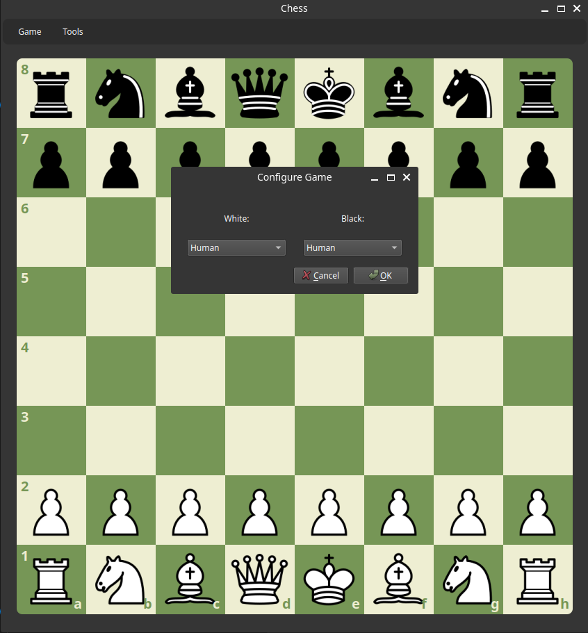

<h1>DAT550-Project-Chess_bot</h1>
A repository for a UiS project.

Members: Raphaël Gauthier, Harry Chicheortiche, Ronald Paleczny

The project consists of designing a chess bot through several methods:
<ul>
    <li>Four baseline models using decision tree, random forest and a Monte-Carlo Tree Search.</li>
    <li>Two complex models using CNN</li>
</ul>

The following explains how to use the code we wrote.

<h3>First installation steps</h3>
First, you need to clone the repository into a direction on your computer using https or SSH. Then install the needed libraires. The recommended method is to create a virtual environment with:
<ul>
    <li>python -m venv .venv (Windows)</li>
    <li>python3 -m venv .venv (Linux)</li>
</ul>

The activate the environment:
<ul>
    <li>source .venv/bin/activate (Linux)</li>
    <li>source .venv/Scripts/activate (Windows + bash terminal)</li>
</ul>

Then do the following command in your terminal: pip install -r requirements.txt
If this does not work, just install the mentionned libraries in the file without their version like:
  
pip install chess matplotlib pandas numpy seaborn pyqt5 tqdm zstandard
 

If you have another method to create an environment like anaconda, it should work.

<h3>Stockfish evaluator</h3>
You need to install the stockfish bot in order to evaluate the bots. You can download it on this <a href = https://stockfishchess.org/download>link</a>

<h3>Notebooks</h3>
They are several notebooks that are interested to see.
<ol>
    <li>lowELO.ipynb is a notebook where the low ELO dataset is generated.</li>
    <li>evaluation.ipynb import the differents baseline bots, train them and evaluate them.</li>
</ol>

<h3>Graphical user interface</h3>
A GUI has been written to see the bots play in action. It can be launch with the following command.
  
python main.py
  
You can choose the white player and the black player. If it is a two bots game, you need to launch the game manually using the "Launch game" command in the menu bar at the top of the window.  

    

<h3>Monte Carlo Tree Search (MCTS) Model</h3>
Run the file <i>selfplay_to_pgn.py</i> in order to produce a sample game (output = sample_game.pgn i.e. game with specific parameters on the top of the file <i>selfplay_to_pgn.py</i>i>: MAX_PLIES = 60 (total nb of moves), MCTS_ITERS_PER = 30 (nb of iteration = MAX_PLIES / 2), DEPTH = 4 (depth of the tree).
Run the file <i>evaluate_vs_stockfish.py</i> in order to plot the success rate of Stockfish’s move being among the top five proposals generated by the bot (time consumming !).

